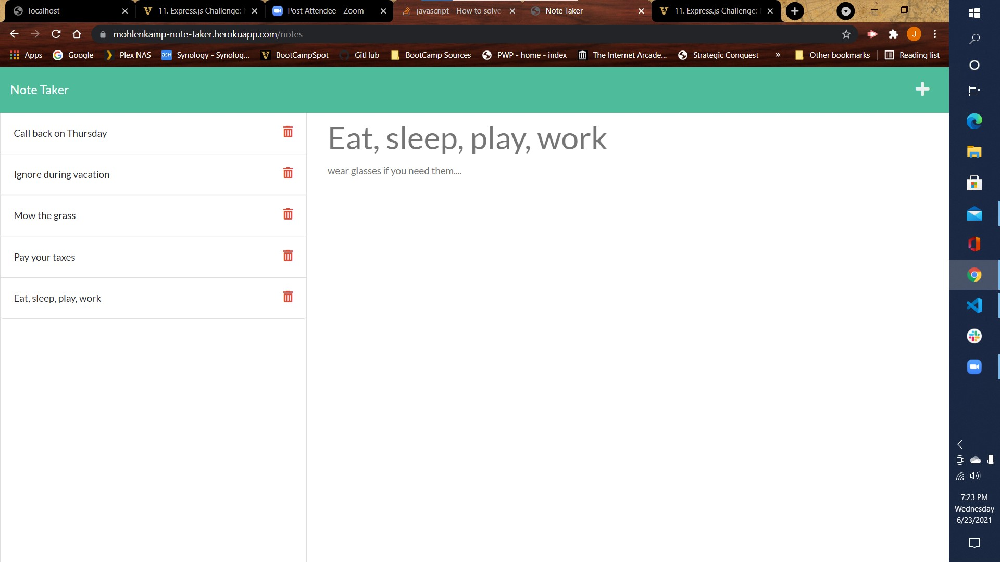

# Note Taker 

## John Mohlenkamp
## June 23, 2021

## GitHub Location: https://github.com/Mohlenkamp/note-taker

## Heroku Location: https://mohlenkamp-note-taker.herokuapp.com/

## Description 

This is a notepad type program that uses Node.js, Express, and Heroku to create a web server to deliver this program to the user.

The basic landing page will link the user to the \notes path to actually create/read/edit/remove a note. The stored notes will be listed on the left side, and any selected note will show its details on the right side of the screen. 

A new message can be started using the + button on the upper left, and it can be saved to the db.json file by choosing the save button. 

The red garbage can showing on each saved message on the left menu will delete that message.

